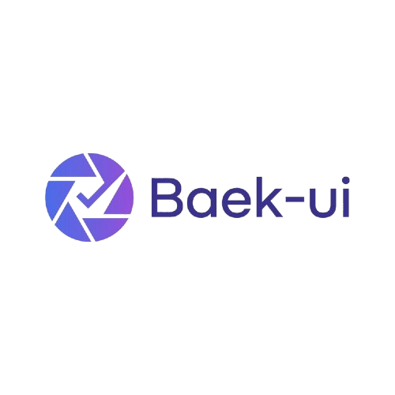
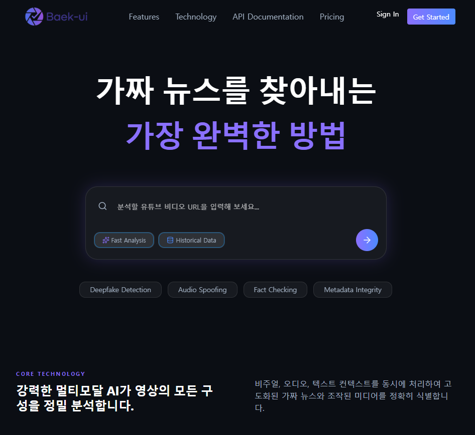

# ✨ 백의(Baek-ui) AI 미디어 무결성 정밀 분석 에이전트 Prototype

## 🧑‍🎓 2026년 학생 창업유망팀 300⁺ 출품작
### 🔖 백의 로고

### 🖼️ 메인 디자인 컨셉

### 🎥 실시간 라이브 데모 (Reflex Cloud)
**공식 배포 주소:** [프로토타입 사이트 링크](https://workspaces-lime-ocean.reflex.run/)

## 📖 개요
백의(Baek-ui)는 딥페이크 영상과 가짜뉴스 확산을 방지하기 위해 개발된 차세대 미디어 무결성 검증 플랫폼입니다. 최신 Generative AI 기술의 발전으로 인해 인간의 눈으로는 구별하기 어려운 가짜 영상 콘텐츠가 범람하는 시대에, 백의는 신뢰할 수 있는 미디어 검증 솔루션을 제공하여 정보 생태계의 투명성을 확보하는 것을 목표로 합니다.

## ⚙️핵심 기능
### 1. 실시간 유튜브 영상 분석
단순 URL 입력만으로 유튜브 영상에 대한 정밀 분석이 가능합니다. 실시간 스트리밍 분석 기술을 통해 사용자는 기다림 없이 빠르게 결과를 확인할 수 있습니다.

### 2. AI 기반 딥페이크 탐지
정교한 딥페이크(Deepfake) 및 영상 조작 시도를 탐지합니다. 최신 AI 모델을 활용하여 영상 내의 미묘한 비정상 패턴을 감지하고 신뢰도 점수로 환산합니다.

### 3. 교차 팩트 체크 시스템
영상 콘텐츠에 포함된 주장들을 실시간으로 검증합니다. 다양한 공신력 있는 소스의 정보를 교차로 비교하여 사실 여부를 판단하고, 근거 자료와 함께 제공합니다.

## 👥 사용자 경험
### 1. 직관적인 채팅 인터페이스
복잡한 설정 없이 자연스러운 대화를 통해 분석을 요청할 수 있습니다. AI 에이전트와의 상호작용을 통해 분석 결과를 쉽게 이해할 수 있도록 돕습니다.

### 2. 실시간 진행 상황 공유
영상이 분석되는 동안 진행 상황을 실시간으로 제공합니다. 사용자는 어떤 단계가 진행 중인지 투명하게 확인할 수 있어 신뢰감을 더합니다.

## 🏗️ 기술 스택
- **프레임워크**: Reflex (Python 기반 웹 프레임워크)
- **AI 모델**: 비디오-텍스트 매칭, 딥페이크 탐지 모델, 팩트 체크 LLM
- **데이터베이스**: (향후 고도화 예정) 사용자 데이터 및 분석 이력 저장
- **배포**: (향후 고도화 예정) Docker 기반 컨테이너화 및 클라우드 배포

## 📅 향후 계획
초기 버전인 프로토타입에서는 유튜브 영상 분석 기능에 집중합니다. 이후 버전에서는 자체 데이터베이스 구축, 다양한 소셜 미디어 플랫폼 지원, 사용자 계정 관리 기능 등을 추가하여 전문적인 미디어 검증 플랫폼으로 확장할 계획입니다.

## 📄 라이선스
본 소프트웨어는 학습 및 경진대회 출품을 목적으로 개발된 프로토타입입니다. 상업적 이용 시에는 별도의 라이선스 협의가 필요합니다.