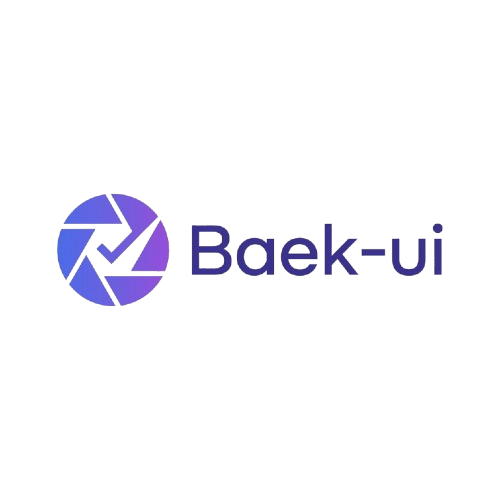

# ✨ 백의(Baek-ui) 보이스피싱 문구 위험도 탐지 Prototype

## 🧑‍🎓 2026년 학생 창업유망팀 300⁺ 출품작
### 🔖 백의 로고


### 🎥 실시간 라이브 데모 (Reflex Cloud)
현재 배포본은 이전 버전(딥페이크 영상 분석)이라 내려두었습니다. **보이스피싱 탐지 버전으로 재배포 예정입니다.**

## 📖 개요
백의(Baek-ui)는 보이스피싱·스미싱 피해를 막기 위해 개발된 문구 위험도 탐지 서비스입니다. 의심스러운 문자나 통화 내용을 붙여넣으면, 위험 신호를 찾아내고 과거 사기 사례와 대조해 **0~100점의 위험 점수와 그 판단 근거**를 돌려줍니다.

사기 문구는 사람을 속이도록 정교하게 다듬어져 있어, 받은 사람이 혼자 판단하기 어렵습니다. 백의는 "이건 사기다"라고 단정하는 대신 **왜 위험한지를 근거와 함께 보여주어**, 사용자가 스스로 판단할 수 있게 돕는 것을 목표로 합니다.

## ⚙️ 핵심 기능
### 1. 의심 문구 위험도 탐지
문구를 붙여넣으면 4단계 파이프라인(전처리 → 위험 패턴 대조 → 유사 사례 검색 → 종합 판정)이 실행되고, 각 단계의 진행 상황이 실시간으로 표시됩니다. 전화번호·계좌번호·링크는 분석 전에 마스킹되며, 입력한 문구는 저장하지 않습니다.

### 2. 규칙 + 벡터 유사도 하이브리드 탐지
기관 사칭, 안전계좌 요구, 계좌 동결 위협, 선입금 유도 등 **16종의 위험 신호 규칙**과, 실제 사기 사례와의 **벡터 유사도**를 함께 사용합니다. 최종 점수는 `규칙 점수 × 0.6 + 유사도 점수 × 0.4`이며, 0–34는 안전 · 35–69는 주의 · 70–100은 위험으로 판정합니다.

규칙은 단어가 등장했다는 사실만으로 반응하지 않습니다. "국세청에서 환급금은 신청하신 계좌로 처리됩니다" 같은 정상 안내문과 "계좌번호를 알려주세요" 같은 사기 요구를 구분하기 위해, **명사 뒤에 실제 요구 동사가 뒤따를 때만** 위험 신호로 인정하도록 설계했습니다.

### 3. 판단 근거와 권장 행동 제시
점수만 던지지 않습니다. 어떤 위험 신호가 몇 점을 올렸는지, 어떤 실제 사례와 얼마나 닮았는지, 그리고 지금 무엇을 해야 하는지를 함께 제시합니다.

## 👥 사용자 경험
### 1. 붙여넣기 한 번으로 끝나는 입력
복잡한 설정이나 로그인이 없습니다. 문구를 붙여넣고 버튼을 누르면 됩니다. 어떤 문구를 넣어야 할지 막막하지 않도록 기관사칭·대출사기·정상 예시를 한 번의 클릭으로 넣어볼 수 있습니다.

### 2. 실시간 진행 상황 공유
분석이 진행되는 동안 4단계 스테퍼로 현재 어느 단계인지 보여줍니다. 사용자는 무엇이 진행 중인지 투명하게 확인할 수 있습니다.

### 3. 불안을 키우지 않는 화면
사기 피해를 걱정하며 들어온 사용자를 겁주지 않도록, 차분하고 안정적인 색채를 사용했습니다. 위험 등급은 색의 강도만이 아니라 배지·좌측 스트라이프·번호 같은 형태로도 전달해, 색을 구분하기 어려운 경우에도 읽히게 했습니다.

## 🏗️ 기술 스택
- **프레임워크**: Reflex (Python 기반 웹 프레임워크)
- **탐지**: 정규식 규칙 사전 + 문자 3-gram 해싱 기반 64차원 벡터 임베딩 (외부 API 없이 동작)
- **데이터베이스**: (향후 예정) Supabase — 현재는 Repository 인터페이스 뒤의 인메모리 Mock
- **테스트**: pytest + pytest-asyncio

## 📅 향후 계획
- 인메모리 Mock 저장소를 **Supabase**로 교체 (Repository 인터페이스는 이미 분리되어 있어 호출부 수정 없이 교체 가능)
- 실사용 데이터에서 동의어 변형 수법이 관측되면 **의미 임베딩 도입 재검토** (현재는 오프라인·무과금 유지를 위해 자체 해싱 임베딩을 채택 — [결정 근거](./assets/backend-decision-making.md) 6-4절)
- 보이스피싱 연관 단어 뭉치 **3D 시각화** 화면 추가
- 실사용 데이터 기반 규칙 사전 갱신 및 탐지 성능 개선

## 🚀 실행 방법
```bash
pip install -r requirements.txt
reflex run       # http://localhost:3000
pytest           # 백엔드 테스트
```

## 📄 라이선스
본 소프트웨어는 학습 및 경진대회 출품을 목적으로 개발된 프로토타입입니다. 상업적 이용 시에는 별도의 라이선스 협의가 필요합니다.
