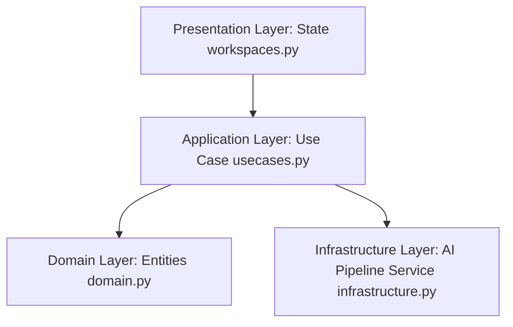

# ⚙️ 백의(Baek-Ui) 백엔드 기술 의사결정 문서 (Backend Decision Making)

본 문서는 백의(Baek-Ui) AI 미디어 무결성 정밀 분석 플랫폼 프로토타입의 백엔드 아키텍처, 데이터 플로우, 그리고 핵심 비즈니스 로직 설계 결정 사항을 기록한 문서입니다.

---

## 1. 백엔드 핵심 프레임워크 선정: Reflex (FastAPI-Based Backend)

### 📌 선택한 기술: **Reflex Backend (FastAPI & Python Asyncio)**
백의 플랫폼의 백엔드는 **FastAPI**를 랩핑하여 작동하는 **Reflex** 백엔드를 채택하였습니다. Reflex 엔진은 클라이언트와의 상태 동기화 및 실시간 데이터 스트리밍을 처리하기 위해 내부적으로 비동기 이벤트 루프와 고성능 웹소켓(Websocket) 통신을 활용합니다.

### 🔍 기술적 선정 이유
1. **고성능 비동기 처리 (Asynchronous I/O)**
   - 미디어 다운로드, 프레임 디코딩, STT 변환, AI 모델 추론, 외부 데이터베이스 대조 등 대기 시간이 길고 I/O 집약적인 작업을 효율적으로 처리하기 위해 Python의 `asyncio` 기반 비동기 아키텍처가 필수적이었습니다. FastAPI 기반의 Reflex 백엔드는 비동기 요청 처리에 최적의 성능을 냅니다.
2. **상태 동기화(State Synchronization) 자동화**
   - 기존의 분리형 백엔드-프론트엔드 모델에서는 별도의 REST API 또는 웹소켓 핸들러를 수동으로 설계하고 데이터 포맷(JSON)을 맞추어야 했습니다. Reflex는 백엔드의 `State` 변수 변경 사항을 실시간으로 프론트엔드에 자동으로 전달하여 네트워크 오버헤드와 통신 계층 개발 비용을 획기적으로 낮췄습니다.
3. **AI 라이브러리 및 에코시스템 결합성**
   - 백의의 정밀 분석 기능은 다양한 오픈소스 AI 모델(Deepfake Detection, Audio Frequency Analysis, LLM Fact-Checking)에 의존합니다. Python 생태계 내에서 이러한 AI 가속 라이브러리(PyTorch, Transformers, HuggingFace 등)와의 네이티브 통합이 가능하도록 Python 백엔드를 전격 채택하였습니다.

---

## 2. 소프트웨어 아키텍처 패턴: 클린 아키텍처 (Clean Architecture)

프로토타입 단계에서 코드 복잡성이 낮을 때부터 구조적 안정성을 도모하고, 향후 실제 AI 파이프라인 및 데이터베이스 고도화 시 사이드 이펙트를 방지하기 위해 **클린 아키텍처(Clean Architecture)** 사상을 차용하였습니다.



### 📂 레이어별 역할 분담
1. **도메인 레이어 (`workspaces/domain.py`)**
   - 백의 서비스의 본질적인 비즈니스 규칙과 데이터 모델을 정의합니다.
   - 외부 라이브러리나 특정 웹 프레임워크(Reflex, FastAPI)에 종속되지 않는 순수 Python 데이터클래스(`VideoMetadata`, `AnalysisReport`, `FactCheckResult`)와 분석 상태 열거형(`AnalysisStatus`)만으로 구성되어 있어 높은 이식성을 가집니다.
2. **인프라스트럭처 레이어 (`workspaces/infrastructure.py`)**
   - 외부 시스템, AI 추론 엔진 및 제3자 API와의 연동을 구체화합니다.
   - `AIPipelineService` 클래스는 원본 영상 매칭(`match_video`), 오디오-비주얼 분석(`analyze_audio_visual`), 외부 팩트 데이터베이스 교차 검증(`fact_check`)을 수행합니다. 프로토타입 단계에서는 `asyncio.sleep`을 이용한 시뮬레이션(Mocking)으로 구현되어 향후 실제 모델 연동 시 수정 범위가 이 레이어로만 제한됩니다.
3. **애플리케이션 레이어 (`workspaces/usecases.py`)**
   - 시스템의 구체적인 사용자 시나리오(유즈케이스)를 구현합니다.
   - `AnalyzeVideoUseCase`는 `AIPipelineService` 인프라 서비스를 주입(Dependency Injection)받아 영상 분석 파이프라인의 전반적인 단계를 순서대로 조율하고 최종 `AnalysisReport` 도메인 모델을 컴파일합니다.
4. **프레젠테이션 레이어 (`workspaces/workspaces.py`)**
   - 사용자 인터랙션 수신 및 UI 상태 관리를 담당합니다.
   - `State` 클래스는 유즈케이스의 분석 진행 단계(비동기 발전기)를 스트리밍 형태로 받아 사용자 화면에 즉각 전송하고, 도메인 엔티티를 UI 렌더링에 적합한 데이터 구조(`ReportData`)로 매핑 및 변환합니다.

---

## 3. 실시간 데이터 플로우 및 비동기 스트리밍 (Asynchronous Data Flow)

영상 분석은 장시간 소요되는 무거운 작업이므로, 사용자에게 진행 상황을 실시간으로 투명하게 공유하는 UX가 중요합니다. 이를 위해 비동기 발전기(`AsyncGenerator`)와 비동기 이터레이터(`async for`) 패턴을 구축하였습니다.

```
[UI] (State.start_analysis 호출)
  │
  ▼
[Use Case] (execute 메서드 시작)
  │
  ├─► yield AnalysisStatus.MATCHING (인프라 매칭 대기)
  │
  ├─► yield AnalysisStatus.STT_ANALYZING (인프라 오디오/비주얼 분석 대기)
  │
  ├─► yield AnalysisStatus.FACT_CHECKING (인프라 팩트체크 대기)
  │
  └─► yield AnalysisStatus.COMPLETED (최종 리포트 생성 및 전달)
```

1. **상태 스트리밍**: `AnalyzeVideoUseCase.execute`는 각 태스크가 완료될 때마다 현재 작업 상황(`AnalysisStatus`)을 즉시 호출처로 반환(`yield`)합니다.
2. **비동기 UI 업데이트**: 프레젠테이션 레이어인 `State`는 웹소켓 커넥션을 차단하지 않은 채 비동기적으로 이 상태 신호를 감지하고, 화면의 진행 상황 안내 문구를 갱신한 뒤 UI 변경 사항을 클라이언트에 푸시합니다.

---

## 4. 백엔드 AI 파이프라인 및 MCP 연동 설계 (Future Integration Roadmap)

백의 백엔드의 최종 아키텍처는 가상의 파이프라인에서 실제 분산형 멀티모달 검증 파이프라인으로 전환될 예정입니다.

1. **멀티모달 AI 파이프라인 실연**
   - **Video/Visual**: CNN/Transformer 기반 딥페이크 아티팩트 및 얼굴 표정 비일관성 탐지 모델 탑재.
   - **Audio**: 오디오 주파수 대역 이상 탐지 및 합성 목소리 검출(TTS 가짜 음성 판별) 모듈 탑재.
   - **Text**: Whisper를 활용한 정밀 자막 생성(STT) 및 생성된 텍스트 컨텍스트 분석.
2. **MCP (Model Context Protocol) Bridge 및 Graph RAG**
   - 단순 키워드 검색을 넘어, 의미론적 관계망을 기반으로 한 교차 검증을 위해 **Graph RAG** 기술을 도입합니다.
   - 정부24 공식 보도자료, 행정안전부 배포 자료 등 공신력 있는 외부 사실 검증 데이터베이스와 연동하기 위한 표준 인터페이스로 **MCP Bridge**를 백엔드에 장착하여 안전한 실시간 정보 연동 인프라를 마련합니다.

---

## 5. 백엔드 아키텍처의 장단점 및 트레이드오프

### 👍 장점
- **높은 모듈성 및 테스트 용이성**: 클린 아키텍처 설계 덕분에 AI 추론 하드웨어 성능이나 외부 API 구성이 바뀌더라도 프론트엔드 UI 및 핵심 도메인 규칙을 수정할 필요가 없음.
- **Python 단일 스택의 강점**: AI 모델 서빙 코드와 데이터 전처리 로직을 별도의 마이크로서비스로 분리할 필요 없이 단일 백엔드 모놀리스 구조로 신속히 구동 가능.

### 👎 단점 및 해결 방향
- **GIL (Global Interpreter Lock)로 인한 멀티코어 연산 제약**: 대용량 동영상 프레임 병렬 디코딩 및 실시간 딥페이크 분석 시 Python의 GIL로 인해 CPU 연산 병목 현상이 발생할 수 있음.
- **해결 방안**: 프로덕션 배포 단계에서는 CPU/GPU 연산이 집중되는 모델 추론 및 영상 전처리 작업을 Celery 또는 Redis Queue와 같은 비동기 작업 큐로 분산하고, Reflex 백엔드는 비동기 I/O 오케스트레이션 및 게이트웨이 역할에 집중하도록 구조적 분리를 단행할 예정.

---

## 6. 향후 도입 및 확장 예정 기술 스택 (Planned Tech Stack Expansion)

프로토타입 단계를 넘어 본격적인 대규모 트래픽 대응 및 실시간 AI 무결성 검증 고도화를 위해 아래의 백엔드 기술 스택을 추가로 도입하여 구현에 반영할 계획입니다.

### ⚡ 1. Uvicorn standard
- **선정 이유**: 고성능 비동기 ASGI 서버 구동 및 실시간 이벤트 동시성 제어
- **상세 설명**: Reflex 및 FastAPI 애플리케이션을 배포 환경에서 최적의 성능으로 서비스하기 위해 standard 버전을 채택합니다. uvloop와 httptools 등 C 기반의 빠른 모듈들을 포함하여 실시간 웹소켓 이벤트 스트리밍의 동시 처리 능력을 극대화합니다.

### 🗄️ 2. Supabase
- **선정 이유**: PostgreSQL을 활용한 데이터 저장 기술 (메인 데이터베이스 역할)
- **상세 설명**: 분석 요청 이력, 검증된 동영상 메타데이터, 사용자 권한 및 히스토리를 체계적으로 보관하기 위한 핵심 RDBMS로 Supabase를 연동하여 완전 클라우드 관리형 데이터 아키텍처를 구축합니다.

### 🌲 3. Pinecone
- **선정 이유**: PostgreSQL 내 코사인 유사도 연산 및 시맨틱 RAG 통합 검색 구현 (벡터 DB)
- **상세 설명**: 팩트체크와 관련 기사, 영상 텍스트 자막 등 대량의 비정형 문서를 의미론적으로 비교 검색하기 위해 초고속 벡터 데이터베이스인 Pinecone을 연동하여 코사인 유사도 기반의 고도화된 RAG 검색 인프라를 확립합니다.

### 🧬 4. Google Gemini Embedding
- **선정 이유**: gemini-embedding-001 모델을 활용하여 768차원 고차원 의미 벡터 생성
- **상세 설명**: 동영상 스크립트와 주장(Claim) 텍스트를 고차원 의미 공간으로 임베딩하여, 팩트체크 시 문서들 간의 정확한 문맥상의 의미 유사도를 계산할 수 있도록 지원합니다.

### 🤖 5. Google Gemini Generative
- **선정 이유**: gemini-3.5-flash 모델 탑재 및 실시간 RAG 기반 답변 생성
- **상세 설명**: 백의 에이전트의 핵심 지능 역할을 담당합니다. 실시간 수집된 팩트 데이터와 오디오-비주얼 탐지 결과를 결합하여 최종 사용자의 질문에 답하고, 다각도 검증 분석 보고서를 자연어로 일목요연하게 작성합니다.

### 🔑 6. pyjwt
- **선정 이유**: C/Rust 컴파일러 빌드 오류 방지를 위해 python-jose를 대체한 순수 파이썬(Pure Python) JWT 기반 인증 아키텍처 구현
- **상세 설명**: 배포 및 도커 환경에서 라이브러리 간 컴파일러 충돌이나 플랫폼별 의존성 빌드 에러를 방지하기 위해, 암호화 패키지 의존성이 덜하고 순수 파이썬으로 구현된 pyjwt를 도입하여 가볍고 견고한 사용자 토큰 인증 로직을 수립합니다.

### 🔒 7. hashlib & hmac
- **선정 이유**: C/Rust 의존성이 무거운 bcrypt를 우회하여 순수 파이썬 해시 솔팅 및 단방향 암호화 처리 구현
- **상세 설명**: 비밀번호 해싱 시 플랫폼 독립성을 위해 bcrypt 외부 라이브러리 대신 파이썬 내장 라이브러리인 hashlib와 hmac을 사용합니다. 고전적인 PBKDF2 알고리즘이나 솔트(Salt) 추가 방식을 구현하여 보안성을 충족시키면서도 시스템 경량화를 유지합니다.

### 🛡️ 8. Pydantic
- **선정 이유**: 컴파일 레벨 데이터 유효성 검증 및 인젝션 공격 원천 차단
- **상세 설명**: 백엔드로 유입되는 모든 데이터 스키마(요청 및 응답 DTO)에 정적 타입을 정의하고 강력한 런타임 유효성 검사를 수행함으로써 부적절한 입력(SQL 인젝션, XSS 등)이 핵심 비즈니스 도메인으로 넘어가지 않도록 강력한 보호막 역할을 수행합니다.

### 🧪 9. Pytest
- **선정 이유**: 단위/통합 테스트 자동화 스위트 구축
- **상세 설명**: 도메인 엔티티, 유즈케이스 시나리오, AI 분석 핸들러에 대해 독립적이고 자동화된 테스트 환경을 마련하여 코드 변경으로 인한 회귀(Regression) 오류를 미리 감지하고 배포 안정성을 확보합니다.

### 🌐 10. HTTPX Client
- **선정 이유**: API 통합 테스트용 비동기 비차단 HTTP 통신 지원
- **상세 설명**: Pytest 통합 테스트 환경이나 백엔드가 외부 API(유튜브 메타데이터 서버, 정부 오픈 API 등)와 비차단 방식으로 대규모 네트워크 통신을 병렬 수행할 수 있도록 고성능 비동기 HTTP 클라이언트인 HTTPX를 도입합니다.

### 🚨 11. Sentry SDK
- **선정 이유**: 실시간 APM 모니터링, 예외 트래킹 및 성능 매트릭스 수집
- **상세 설명**: 실제 배포 환경에서 발생하는 소스 코드 레벨의 오류(Error Stack Trace)를 실시간 감지하여 개발자에게 슬랙 알림 등으로 즉각 리포팅하며, 분석 지연 구간에 대한 프로파일링을 수행하여 시스템 전반의 성능 매트릭스를 지속적으로 모니터링합니다.

