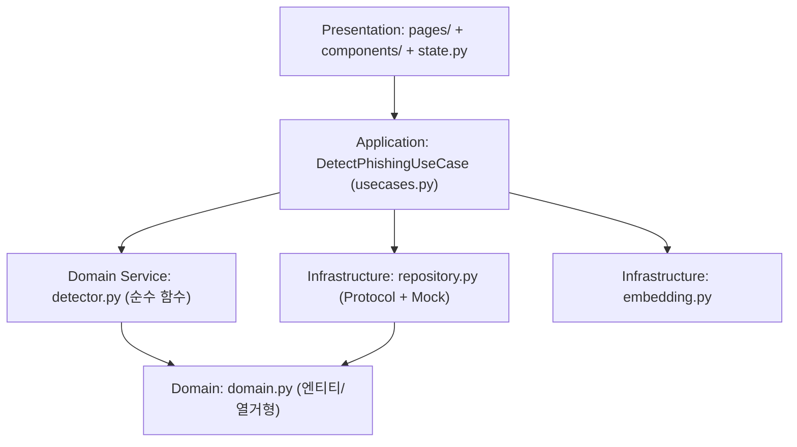

# ⚙️ 백의(Baek-Ui) 백엔드 기술 의사결정 문서 (Backend Decision Making)

본 문서는 백의(Baek-Ui) 보이스피싱 문구 위험도 탐지 프로토타입의 백엔드 아키텍처, 데이터 플로우, 그리고 핵심 탐지 로직 설계 결정 사항을 기록한 문서입니다.

> 이 프로토타입의 탐지는 **전 과정이 오프라인**에서 동작합니다. 외부 AI API 호출이 없고(정규식 규칙 사전 + 결정론적 해싱 임베딩), 사용자가 입력한 문구는 저장하지도 외부로 전송하지도 않습니다.

---

## 1. 백엔드 핵심 프레임워크 선정: Reflex (FastAPI-Based Backend)

### 📌 선택한 기술: **Reflex Backend (FastAPI & Python Asyncio)**
백의의 백엔드는 **FastAPI**를 랩핑하여 작동하는 **Reflex** 백엔드를 채택하였습니다. Reflex 엔진은 클라이언트와의 상태 동기화 및 실시간 데이터 스트리밍을 처리하기 위해 내부적으로 비동기 이벤트 루프와 웹소켓(Websocket) 통신을 활용합니다.

### 🔍 기술적 선정 이유
1. **탐지 로직과 UI가 같은 언어에 놓임**
   - 이 서비스의 핵심 자산은 한국어 정규식 규칙 사전(`rules.py`)과 벡터 유사도 연산(`embedding.py`)입니다. 둘 다 Python으로 작성·테스트하는 것이 자연스러운 영역이고, Reflex는 UI까지 Python으로 기술하므로 **별도의 프론트엔드 언어와 API 스키마를 관리할 필요가 없습니다**. 프로토타입 단계에서 이 절감 효과가 가장 컸습니다.
2. **상태 동기화(State Synchronization) 자동화**
   - 분석 진행 상황을 4단계 스테퍼로 실시간 표시하는 것이 이 서비스의 핵심 UX입니다. 분리형 백엔드-프론트엔드 구조였다면 별도의 웹소켓 핸들러와 메시지 포맷을 직접 설계해야 했지만, Reflex는 백엔드 `State` 변수의 변경을 자동으로 클라이언트에 푸시합니다. 즉 **진행률 스트리밍이 통신 계층 코드 없이 확보**됩니다.
3. **비동기 인터페이스의 확장 여지**
   - 현재 탐지 연산은 CPU 기준 밀리초 단위로 끝나므로 비동기가 성능상 필수는 아닙니다. 다만 `PhishingRepository`를 async 인터페이스로 정의해 두어, 향후 Supabase 등 네트워크 기반 저장소로 교체할 때 호출부(`usecases.py`) 수정 없이 그대로 대체됩니다.

> ⚖️ **트레이드오프**: Reflex는 Python 코드를 Next.js로 컴파일하는 구조라, 세밀한 CSS·컴포넌트 제어에서 제약이 있습니다(예: `border_radius="full"`은 Radix 컴포넌트에서만 동작해 일반 `rx.box`에는 `9999px`를 직접 지정해야 함). UI 자유도를 일부 포기하는 대신 단일 스택의 개발 속도를 취한 결정입니다.

---

## 2. 소프트웨어 아키텍처 패턴: 클린 아키텍처 (Clean Architecture)

프로토타입 단계에서 코드 복잡성이 낮을 때부터 구조적 안정성을 도모하고, 향후 저장소·임베딩 교체 시 사이드 이펙트를 방지하기 위해 **클린 아키텍처(Clean Architecture)** 사상을 차용하였습니다.


```mermaid
graph TD
    UI["Presentation: pages/ + components/ + state.py"] --> UC["Application: DetectPhishingUseCase (usecases.py)"]
    UC --> Detector["Domain Service: detector.py (순수 함수)"]
    UC --> Repo["Infrastructure: repository.py (Protocol + Mock)"]
    UC --> Emb["Infrastructure: embedding.py"]
    Detector --> Domain["Domain: domain.py (엔티티/열거형)"]
    Repo --> Domain
```

### 📂 레이어별 역할 분담
1. **도메인 레이어 (`workspaces/domain.py`)**
   - 서비스의 본질적인 데이터 모델과 판정 규칙을 정의합니다.
   - 외부 라이브러리나 특정 웹 프레임워크(Reflex, FastAPI)에 종속되지 않는 순수 Python 데이터클래스(`PhishingCase`, `DetectionEvidence`, `SimilarCase`, `DetectionReport`)와 열거형(`DetectionStatus`, `RiskLevel`, `PhishingCategory`)만으로 구성되어 높은 이식성을 가집니다.
   - 위험 등급 판정(`RiskLevel.from_score`)처럼 프레임워크와 무관한 규칙은 이 레이어에 둡니다.
2. **도메인 서비스 (`workspaces/detector.py`, `workspaces/rules.py`)**
   - 탐지 파이프라인의 각 연산을 **부작용 없는 순수 함수**로 구현합니다: `preprocess`, `score_by_rules`, `score_by_similarity`, `combine_scores`, `recommend_actions`.
   - 순수 함수이므로 웹 서버나 비동기 컨텍스트 없이 단위 테스트가 가능하며, 조율 책임은 전적으로 유즈케이스가 갖습니다.
3. **인프라스트럭처 레이어 (`workspaces/repository.py`, `workspaces/embedding.py`)**
   - 외부 시스템 연동 가능성이 있는 지점을 격리합니다.
   - `PhishingRepository`는 `Protocol`로 정의되고, 현재는 25건의 시드 사례를 담은 `MockPhishingRepository`가 이를 구현합니다. **향후 `SupabasePhishingRepository`를 동일 시그니처로 추가하면 호출부 수정 없이 교체**됩니다.
   - `embedding.py`는 벡터화 방식을 한 모듈로 봉인해, 임베딩 전략 변경의 영향 범위를 이 파일로 한정합니다(현재 전략과 그 결정 근거는 §6.4 참조).
4. **애플리케이션 레이어 (`workspaces/usecases.py`)**
   - 구체적인 사용자 시나리오를 구현합니다.
   - `DetectPhishingUseCase`는 `PhishingRepository`를 생성자로 주입(Dependency Injection)받아 탐지 파이프라인의 단계를 순서대로 조율하고 최종 `DetectionReport` 도메인 모델을 조립합니다.
5. **프레젠테이션 레이어 (`workspaces/state.py`, `pages/`, `components/`)**
   - 사용자 인터랙션 수신 및 UI 상태 관리를 담당합니다.
   - `State` 클래스는 유즈케이스의 진행 단계(비동기 발전기)를 스트리밍으로 받아 화면에 즉시 반영하고, 도메인 엔티티를 UI 렌더링에 적합한 구조(`EvidenceView`, `SimilarCaseView`)로 매핑합니다. 이 뷰 모델들은 **평범한 `dataclass`여야 합니다** — `rx.Base`가 Reflex 0.9에서 제거되었고, 도메인 객체를 state var로 직접 쓸 수 없기 때문입니다.
   - `workspaces/workspaces.py`는 앱 조립과 라우팅(`/`, `/result`)만 담당합니다.

### 🔗 의존성 방향
모든 의존성은 **바깥에서 안으로**만 향합니다. `detector.py`와 `repository.py`는 `domain.py`를 알지만 그 반대는 없고, `state.py`는 `detector.py`·`repository.py`를 직접 호출하지 않고 반드시 유즈케이스를 경유합니다. 파이프라인 단계를 추가할 때도 `DetectionStatus`와 `DetectPhishingUseCase`를 확장하며, 프레젠테이션 레이어가 하위 모듈로 손을 뻗지 않도록 유지합니다.

---

## 3. 실시간 데이터 플로우 및 비동기 스트리밍 (Asynchronous Data Flow)

사기 피해를 걱정하며 들어온 사용자에게 "분석 중"이라는 불투명한 대기 화면을 보여주는 대신, 지금 무엇을 하고 있는지 단계별로 공유하는 것이 이 서비스의 UX 목표입니다. 이를 위해 비동기 발전기(`AsyncGenerator`)와 비동기 이터레이터(`async for`) 패턴을 구축하였습니다.

```
[UI] (State.detect 호출 → 즉시 /result로 redirect)
  │
  ▼
[Use Case] (DetectPhishingUseCase.execute 시작)
  │
  ├─► yield DetectionStatus.PREPROCESSING      (전화번호·계좌·링크 마스킹)
  │
  ├─► yield DetectionStatus.RULE_SCORING       (16종 규칙 사전 대조)
  │
  ├─► yield DetectionStatus.SIMILARITY_SEARCH  (저장소 top-3 유사 사례 검색)
  │
  ├─► yield DetectionStatus.JUDGING            (가중합 → 위험 등급 산출)
  │
  └─► yield DetectionStatus.COMPLETED          (최종 리포트 last_report에 적재)
```

1. **상태 스트리밍**: `DetectPhishingUseCase.execute`는 각 단계에 진입할 때마다 현재 상황(`DetectionStatus`)을 즉시 호출처로 반환(`yield`)합니다.
2. **비동기 UI 업데이트**: 프레젠테이션 레이어인 `State.detect`는 `async for`로 이 신호를 받아 스테퍼 인덱스를 갱신하고, **매 단계마다 `yield`** 하여 Reflex가 변경분을 웹소켓으로 푸시하게 합니다. 중간에 `yield`를 생략하면 모든 단계가 끝난 뒤 한 번에 반영되어 스테퍼가 동작하지 않습니다.
3. **선(先) 리다이렉트 후 스트리밍**: `detect`는 분석을 시작하기 전에 `rx.redirect("/result")`를 먼저 내보냅니다. 사용자는 입력 즉시 결과 페이지로 이동하고, 진행 상황이 그 화면 위에서 채워집니다.

### 🧩 설계상의 제약과 우회
- **반환값을 못 주는 발전기**: async generator는 `async for` 소비자에게 `return` 값을 전달할 수 없습니다. 그래서 최종 `DetectionReport`는 반환 대신 **유즈케이스 인스턴스의 `last_report` 속성에 적재**하고, 스트림 종료 후 `State`가 읽어갑니다.
- **의도적인 단계 지연**: 실제 탐지 연산은 밀리초 단위로 끝나 스테퍼가 눈에 보이지 않고 지나갑니다. 각 단계 사이에 `_STEP_DELAY = 0.4`초의 `asyncio.sleep`을 두어 사용자가 진행 과정을 인지할 수 있게 했습니다. **성능 한계가 아니라 가독성을 위해 의도적으로 삽입한 지연**이며, 실제 무거운 연산(네트워크 저장소 조회 등)이 들어오면 제거 대상입니다.

---

## 4. 핵심 탐지 로직 설계 (Hybrid Scoring)

탐지는 **규칙 기반 점수**와 **사례 유사도 점수**의 가중합으로 산출됩니다. 두 방식은 실패하는 지점이 서로 다르기 때문에 함께 씁니다 — 규칙은 처음 보는 표현을 놓치고, 유사도는 근거를 사람에게 설명하지 못합니다.

```
combine_scores = min(rule_score, 100) × 0.6  +  similarity_score × 0.4
```

### 🔍 4-1. 전처리 (`preprocess`)
URL·전화번호·계좌번호를 각각 `[링크]`, `[전화번호]`, `[계좌번호]`로 치환하고 연속 공백을 정리합니다. 마스킹된 텍스트만 리포트에 실려 화면에 표시되므로, **사용자가 붙여넣은 원문의 식별 정보가 결과 화면에 그대로 남지 않습니다.** (점수 계산 자체는 원문 기준으로 수행합니다.)

### 📋 4-2. 규칙 사전 (`rules.py` → `score_by_rules`)
16종의 위험 신호를 정규식·키워드·설명·가중치(1~40)로 정의하고, 매칭된 규칙을 그대로 `DetectionEvidence`로 변환해 **점수의 근거를 사용자에게 그대로 노출**합니다. 가중치 합은 100에서 절단(cap)합니다.

**설계 원칙 — 명사가 아니라 요구되는 행동을 탐지한다.** 이것이 이 사전에서 가장 중요한 결정이며, 수정 시 반드시 보존해야 합니다. `계좌`, `개인정보` 같은 명사는 조사가 붙더라도(`계좌로`, `개인정보를`) 위험 신호가 될 수 없습니다. 사칭 대상이 되는 바로 그 기관의 정상 안내문에도 똑같이 등장하기 때문입니다("환급금은 신청하신 **계좌로** 처리됩니다", "**개인정보를** 안전하게 보호합니다"). 따라서 명사 뒤에 **실제 요구 동사가 제한된 간격(`_GAP = 15자`) 안에 뒤따를 때만** 신호로 인정합니다.

간격에 상한을 두는 이유도 대칭적입니다. 한국어 어순상 "계좌로 지금 즉시 이체해"처럼 부사가 끼어들 수 있어 0으로 붙일 수는 없지만, 무제한으로 열면 서로 무관한 두 표현이 우연히 근접해 오탐이 발생합니다. 같은 맥락에서 `알려`·`보내`는 독자를 향한 명령형·요청형 어미가 붙은 경우만 인정하고("보내주세요" ⭕ / "보내드립니다" ❌), 이체·송금·입금류는 활용형 어미가 바로 붙어야 인정합니다("송금해" ⭕ / "자동이체 서비스" ❌).

### 🧮 4-3. 유사 사례 점수 (`score_by_similarity`)
입력 문구를 벡터화해 저장소에서 코사인 유사도 상위 3건을 가져온 뒤, **피싱으로 라벨된 사례의 유사도만 합산하되 분모는 top-3 전체**로 나눕니다. 즉 이웃에 정상 사례가 섞여 잡힐수록 점수가 희석되어, 피싱 사례에만 확실히 가까운 문구가 높은 점수를 받습니다. 대조를 위해 시드 25건에는 정상 문자 6건을 의도적으로 포함시켰습니다(피싱 19건 / 정상 6건, 4개 카테고리).

### 🎚️ 4-4. 위험 등급 경계 (`RiskLevel.from_score`)
`0–34 안전 / 35–69 주의 / 70–100 위험`으로 구분합니다. **35라는 경계는 임의로 고른 값이 아닙니다.** 가중치 25짜리 규칙 하나에만 걸린 문구가 결합식을 통과하면 정확히 35점대에 모이는 반면, 홀드아웃 정상 문구는 최고 22점에 그쳤습니다. 두 분포가 이 지점에서 분리되므로 경계를 여기에 두었습니다.

### 🧭 4-5. 권장 행동 (`recommend_actions`)
등급별로 사전 정의된 행동 지침을 반환합니다. 점수만 던지지 않고 "지금 무엇을 해야 하는지"까지 제시하는 것이 제품 목표이며, 위험 등급에서는 은행(1332)·경찰(112) 신고 경로를 명시합니다.

---

## 5. 백엔드 아키텍처의 장단점 및 트레이드오프

### 👍 장점
- **완전한 결정론과 테스트 용이성**: 탐지 경로에 외부 API도 난수도 없어 같은 입력이 항상 같은 점수를 냅니다. 덕분에 목킹이나 네트워크 스텁 없이 실제 로직을 그대로 검증할 수 있고, 현재 **108개 테스트**가 도메인·규칙·탐지 함수·저장소·유즈케이스를 각각 독립적으로 커버합니다.
- **운영 비용과 개인정보 리스크가 0**: 외부 호출이 없으므로 API 키 관리·과금·쿼터 대응이 필요 없고, **사용자가 입력한 문구가 외부로 나가거나 저장되지 않습니다.** 사기 피해를 우려해 민감한 문자를 붙여넣는 서비스 성격상 이 점이 특히 중요합니다.
- **교체 지점의 격리**: 클린 아키텍처 덕분에 저장소(Protocol 뒤)와 임베딩(단일 모듈)이 봉인되어 있어, 향후 고도화의 수정 범위가 해당 파일로 한정됩니다.
- **Python 단일 스택의 개발 속도**: 별도 프론트엔드 스택과 API 계약 없이 단일 모놀리스로 신속히 구동 가능합니다.

### 👎 단점 및 해결 방향
- **임베딩이 표층 기반**: 자체 해싱 임베딩은 의미 임베딩이 아니라 근사 중복 탐지기입니다. 표층을 공유하지 않는 동의어 변형 문구는 유사 사례 검색으로 잡히지 않습니다. → 현재는 규칙 사전(가중치 60%)이 이를 보완하며, 도입 판단 근거와 재검토 조건은 **§6.4**에 정리했습니다.
- **규칙 사전의 수작업 갱신**: 16종 규칙은 공개 보도자료를 참고해 손으로 작성한 것이라, 신종 수법 등장 시 사람이 사전을 갱신해야 반영됩니다. → 실사용 데이터를 축적해 규칙을 주기적으로 보강하고, 오탐 사례를 회귀 테스트로 고정하는 방식으로 대응합니다.
- **사례 저장소의 규모 한계**: 인메모리 시드 25건으로는 유사 사례 커버리지가 좁아, 실제와 다소 다른 수법은 유사도 점수가 낮게 나옵니다. → **§6.2**의 Supabase 도입으로 사례 수를 확장하고, 유사도 검색을 DB 측 벡터 연산으로 옮길 계획입니다.
- **단일 프로세스 인메모리 구조**: 현재 `MockPhishingRepository`는 요청마다 새로 생성되어 시드 임베딩을 매번 계산합니다. 25건 규모에서는 무시할 수 있는 비용이지만, 사례 수가 늘면 저장소 인스턴스 재사용 또는 임베딩 사전 계산이 필요합니다.

---

## 6. 향후 도입 및 확장 예정 기술 스택 (Planned Tech Stack Expansion)

프로토타입 단계를 넘어 본격적인 대규모 트래픽 대응 및 실시간 AI 무결성 검증 고도화를 위해 아래의 백엔드 기술 스택을 추가로 도입하여 구현에 반영할 계획입니다.

### ⚡ 1. Uvicorn standard
- **선정 이유**: 고성능 비동기 ASGI 서버 구동 및 실시간 이벤트 동시성 제어
- **상세 설명**: Reflex 및 FastAPI 애플리케이션을 배포 환경에서 최적의 성능으로 서비스하기 위해 standard 버전을 채택합니다. uvloop와 httptools 등 C 기반의 빠른 모듈들을 포함하여 실시간 웹소켓 이벤트 스트리밍의 동시 처리 능력을 극대화합니다.

### 🗄️ 2. Supabase
- **선정 이유**: PostgreSQL을 활용한 데이터 저장 기술 (메인 데이터베이스 역할)
- **상세 설명**: 분석 요청 이력, 검증된 동영상 메타데이터, 사용자 권한 및 히스토리를 체계적으로 보관하기 위한 핵심 RDBMS로 Supabase를 연동하여 완전 클라우드 관리형 데이터 아키텍처를 구축합니다.

### 🌲 3. Pinecone
- **선정 이유**: PostgreSQL 내 코사인 유사도 연산 및 시맨틱 RAG 통합 검색 구현 (벡터 DB)
- **상세 설명**: 팩트체크와 관련 기사, 영상 텍스트 자막 등 대량의 비정형 문서를 의미론적으로 비교 검색하기 위해 초고속 벡터 데이터베이스인 Pinecone을 연동하여 코사인 유사도 기반의 고도화된 RAG 검색 인프라를 확립합니다.

### 🧬 4. Google Gemini Embedding — ⏸️ 검토 후 채택 보류
- **검토안**: gemini-embedding-001(768차원)을 도입해 `embedding.py`의 자체 해싱 임베딩을 대체
- **결정**: **보류.** 현행 자체 구현(문자 3-gram → 64차원 해싱)을 유지합니다.
- **보류 사유**: 실측 결과 이 서비스의 유사도 요구사항은 자체 구현으로 충족됩니다. 시드 사례 원문에 대한 변형 텍스트 유사도를 측정한 결과, 띄어쓰기·문장부호 변형 1.000 / 기관명 교체 0.918 / 어미·조사 변형 0.782로 **표층 변형에는 충분히 견고**했습니다. 실제 유포되는 보이스피싱 문자가 대량 복붙으로 재사용된다는 점을 고려하면 실전 대부분의 구간이 여기에 해당합니다. 또한 최종 점수에서 유사도 가중치는 40%이고 나머지 60%는 규칙 사전이 담당하므로, 임베딩 품질이 판정 결과를 좌우하는 구조가 아닙니다. 반면 외부 API 도입은 과금·API 키 관리·네트워크 의존성을 발생시키고, **오프라인 결정론적 동작**이라는 현 구조의 장점을 잃게 만듭니다.
- **알려진 한계**: 자체 구현은 의미 임베딩이 아니라 근사 중복 탐지기(near-duplicate detector)입니다. 동의어로 전면 교체된 문장의 유사도는 0.371로, 무관한 텍스트의 바닥선 0.349와 사실상 구분되지 않습니다. 즉 **표층을 공유하지 않는 신종 변형은 유사 사례 검색으로 잡히지 않습니다**(규칙 사전이 이를 보완). 아울러 64차원에 고유 3-gram 636개가 해싱되어 충돌률이 100%이므로, 무관한 텍스트에도 약 0.35의 유사도 바닥선이 깔려 전체 점수를 일정 부분 부풀립니다. 현행 위험 등급 경계(35/70)는 이 바닥선을 포함한 상태로 보정된 값입니다.
- **재검토 조건**: 실사용 데이터에서 동의어 변형 기반 신종 수법이 유의미하게 관측될 때. 단 그 시점에도 외부 API가 유일한 선택지는 아니며, `sentence-transformers` 기반 한국어 로컬 모델(ko-sbert, bge-m3 등)로 오프라인·무과금을 유지하는 안을 먼저 검토합니다.

### 🤖 5. Google Gemini Generative
- **선정 이유**: gemini-3.5-flash 모델 탑재 및 실시간 RAG 기반 답변 생성
- **상세 설명**: 백의 에이전트의 핵심 지능 역할을 담당합니다. 실시간 수집된 팩트 데이터와 오디오-비주얼 탐지 결과를 결합하여 최종 사용자의 질문에 답하고, 다각도 검증 분석 보고서를 자연어로 일목요연하게 작성합니다.

### 🔑 6. pyjwt
- **선정 이유**: C/Rust 컴파일러 빌드 오류 방지를 위해 python-jose를 대체한 순수 파이썬(Pure Python) JWT 기반 인증 아키텍처 구현
- **상세 설명**: 배포 및 도커 환경에서 라이브러리 간 컴파일러 충돌이나 플랫폼별 의존성 빌드 에러를 방지하기 위해, 암호화 패키지 의존성이 덜하고 순수 파이썬으로 구현된 pyjwt를 도입하여 가볍고 견고한 사용자 토큰 인증 로직을 수립합니다.

### 🔒 7. hashlib & hmac
- **선정 이유**: C/Rust 의존성이 무거운 bcrypt를 우회하여 순수 파이썬 해시 솔팅 및 단방향 암호화 처리 구현
- **상세 설명**: 비밀번호 해싱 시 플랫폼 독립성을 위해 bcrypt 외부 라이브러리 대신 파이썬 내장 라이브러리인 hashlib와 hmac을 사용합니다. 고전적인 PBKDF2 알고리즘이나 솔트(Salt) 추가 방식을 구현하여 보안성을 충족시키면서도 시스템 경량화를 유지합니다.

### 🛡️ 8. Pydantic
- **선정 이유**: 컴파일 레벨 데이터 유효성 검증 및 인젝션 공격 원천 차단
- **상세 설명**: 백엔드로 유입되는 모든 데이터 스키마(요청 및 응답 DTO)에 정적 타입을 정의하고 강력한 런타임 유효성 검사를 수행함으로써 부적절한 입력(SQL 인젝션, XSS 등)이 핵심 비즈니스 도메인으로 넘어가지 않도록 강력한 보호막 역할을 수행합니다.

### 🧪 9. Pytest
- **선정 이유**: 단위/통합 테스트 자동화 스위트 구축
- **상세 설명**: 도메인 엔티티, 유즈케이스 시나리오, AI 분석 핸들러에 대해 독립적이고 자동화된 테스트 환경을 마련하여 코드 변경으로 인한 회귀(Regression) 오류를 미리 감지하고 배포 안정성을 확보합니다.

### 🌐 10. HTTPX Client
- **선정 이유**: API 통합 테스트용 비동기 비차단 HTTP 통신 지원
- **상세 설명**: Pytest 통합 테스트 환경이나 백엔드가 외부 API(유튜브 메타데이터 서버, 정부 오픈 API 등)와 비차단 방식으로 대규모 네트워크 통신을 병렬 수행할 수 있도록 고성능 비동기 HTTP 클라이언트인 HTTPX를 도입합니다.

### 🚨 11. Sentry SDK
- **선정 이유**: 실시간 APM 모니터링, 예외 트래킹 및 성능 매트릭스 수집
- **상세 설명**: 실제 배포 환경에서 발생하는 소스 코드 레벨의 오류(Error Stack Trace)를 실시간 감지하여 개발자에게 슬랙 알림 등으로 즉각 리포팅하며, 분석 지연 구간에 대한 프로파일링을 수행하여 시스템 전반의 성능 매트릭스를 지속적으로 모니터링합니다.

