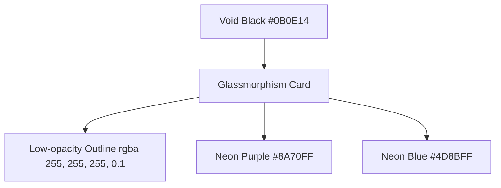

# 🎨 백의(Baek-Ui) 프론트엔드 기술 의사결정 문서 (Frontend Decision Making)

본 문서는 백의(Baek-Ui) AI 미디어 무결성 정밀 분석 플랫폼 프로토타입의 프론트엔드 아키텍처 및 디자인 시스템 설계 결정 사항을 기록한 문서입니다.

---

## 1. 프론트엔드 핵심 프레임워크 선정: Reflex (Python-to-React)

### 📌 선택한 기술: **Reflex Frontend (Python)**
백의 플랫폼은 Python 기반 웹 프레임워크인 **Reflex**를 웹 프론트엔드 및 백엔드 통합 프레임워크로 채택하였습니다. Reflex 프론트엔드는 개발자가 Python으로 작성한 UI 구성 요소를 최신 **React** 및 **Next.js** 코드로 자동 컴파일하여 정적 사이트로 배포하는 구조를 가지고 있습니다.

### 🔍 기술적 선정 이유
1. **단일 언어(Python) 스택을 통한 생산성 극대화**
   - AI 파이프라인 설계, 데이터 처리, 모델 오케스트레이션이 주를 이루는 프로젝트 특성상 프론트엔드와 백엔드를 모두 Python으로 개발함으로써 언어의 일관성을 유지하고 컨텍스트 스위칭 비용을 최소화하였습니다.
2. **리액티브 컴포넌트의 추상화**
   - React의 복잡한 State Management(useState, useEffect, Redux 등)나 Webpack/Vite 번들링 설정을 직접 다루지 않고도, Reflex의 `rx.State`와 이벤트를 통해 실시간 데이터 연동 및 반응형 화면 구성을 손쉽게 구현할 수 있습니다.
3. **Radix UI 및 Tailwind CSS 호환성**
   - Reflex는 하부에서 headless UI 라이브러리인 **Radix UI**를 사용하며 최신 Tailwind CSS v4를 플러그인(`rx.plugins.TailwindV4Plugin()`) 형태로 지원합니다. 이를 통해 견고하고 접근성이 뛰어나며 현대적인 UI를 신속하게 구현할 수 있었습니다.

---

## 2. 디자인 시스템 및 시각 정체성 (Visual Identity)

### 📌 핵심 콘셉트: **보이드 블랙 (Void-Black) & 글래스모피즘 (Glassmorphism)**
백의의 화면 설계는 어두운 디지털 환경에서 미디어를 엄격하게 분석하는 "분석 에이전트"의 아이덴티티를 부각시키기 위해 어둡고 세련된 테마를 기반으로 설계되었습니다.



### 🎨 디자인 시스템 토큰 (`workspaces/styles.py` 및 `design/DESIGN.md` 기준)
- **배경색 (BG_DARK)**: `#0B0E14` (Absolute Black에 가까운 어두운 차콜을 사용하여 고대비 네온 효과를 극대화)
- **주요 포인트 컬러 (ACCENT_PURPLE)**: `#8A70FF` (AI의 '신경망' 이미지와 지능형 에이전트의 정체성을 표현)
- **보조 포인트 컬러 (ACCENT_BLUE)**: `#4D8BFF` (신뢰도와 데이터 검증의 무결성을 신뢰감 있는 블루 컬러로 매핑)
- **글래스모피즘 효과 (GLASS_STYLE)**:
  - 배경 투명도: `rgba(255, 255, 255, 0.05)`
  - 블러 강도: `backdrop-filter: blur(10px)`
  - 미세한 테두리: `border: 1px solid rgba(255, 255, 255, 0.1)` (Rim Lighting 기법을 통해 어두운 배경 속에서 입체감 확보)
- **그라데이션 (PRIMARY_GRADIENT)**: `linear-gradient(90deg, #8A70FF 0%, #4D8BFF 100%)` (퍼플에서 블루로 이어지는 심리스한 빛의 결합 표현)

### ✍️ 타이포그래피 (Typography)
독창적인 분위기와 기능적 가독성을 동시에 만족하기 위해 세 종류의 서체를 적용하였습니다.
1. **Geist**: 대형 디스플레이 및 헤드라인 서체로 사용하여 현대적인 기하학적 정밀함과 날렵한 디자인 강조.
2. **Inter**: 본문 텍스트에 적용하여 긴 분석 결과 보고서나 채팅 히스토리를 읽을 때의 눈 피로도 감소.
3. **JetBrains Mono**: 수치 데이터, 태그, 메타데이터에 적용하여 엔지니어링 도구로서의 느낌을 강화.

---

## 3. 스타일링 전략 및 오버라이드

Reflex 프론트엔드는 Python 코드 내 인라인 스타일 사전(`styles.py`)과 static 리소스로 관리되는 글로벌 스타일시트(`assets/styles.css`)를 혼용하는 하이브리드 전략을 채택했습니다.

### 🛠️ 하이브리드 스타일링 패턴
1. **Python-in-CSS (`styles.py`)**
   - Reflex 컴포넌트의 레이아웃 속성이나 재사용되는 컬러/그라데이션/글래스 스타일 등은 Python 딕셔너리로 선언하여 코드 가독성과 타입 안정성을 확보하였습니다.
2. **글로벌 CSS 오버라이드 (`assets/styles.css`)**
   - Radix Themes가 렌더링하는 내부 컴포넌트(예: Input 필드의 placeholder 가독성, 포커스 시 글자 색상 오버라이드) 중 Python 레벨에서 커스텀하기 번거로운 영역을 CSS 레벨에서 `!important` 키워드로 직접 보정하였습니다.
   - 다크 모드 특화 디자인을 위해 프리미엄 스크롤바 커스텀 스타일(`::-webkit-scrollbar`)을 적용하여 스크롤 영역조차 일관된 다크 톤앤매너를 유지하도록 설계하였습니다.

---

## 4. 실시간 상태 변화 및 렌더링 설계 (State & Interactive UI)

사용자와 대화형 에이전트 간의 동적 인터랙션을 부드럽게 연동하기 위해 단일 페이지 내 상태 전환 설계를 수립하였습니다.

```
[사용자 URL 입력] -> [start_analysis 호출] -> [로딩 상태 & 진행 상태 실시간 갱신] -> [분석 완료 후 신뢰도 리포트 렌더링]
```

- **실시간 프로그레스 스트리밍**: 
  - 백엔드의 `AnalyzeVideoUseCase`가 생성하는 비동기 발전기(`AsyncGenerator`) 값을 프론트엔드가 실시간으로 양도(`yield`)받아 UI 상의 말풍선 메시지(`ChatMessage.content`)를 동적으로 갱신합니다.
- **조건부 렌더링 (`rx.cond`)**:
  - 사용자 역할(User/Assistant)에 따라 다른 배경색 및 테두리 적용.
  - 진행률에 따른 스피너 로딩 컴포넌트 노출 제어.
  - 분석 완료 시, 단일 대화 말풍선 내부에 '영상 신뢰도 검증 리포트' 카드 컴포넌트(`render_report_card`)를 삽입하는 nested UI 구조 실현.

---

## 5. 프론트엔드 아키텍처의 장단점 및 트레이드오프

### 👍 장점
- **신속한 프로토타이핑**: JS/TS 설정 및 프론트-백엔드 간 API 통신 포맷 조율 필요 없이 100% Python 코드로 풀스택 통신 구현.
- **Next.js의 SEO 성능 향상**: 클라이언트 사이드 렌더링에 치우치지 않고 Next.js 기반의 서버 사이드 렌더링(SSR) 및 정적 최적화를 누릴 수 있어 SEO 우위 선점.

### 👎 단점 및 해결 방향
- **세밀한 CSS 조작의 난이도**: Radix UI의 기본 디자인 스타일이 강하게 묶여 있어, 복잡하고 변칙적인 인터랙션을 구현하기 위해서는 `assets/styles.css` 파일에 의존하는 오버라이딩 작업이 늘어남.
- **해결 방안**: 향후 고도화 단계에서 Tailwind CSS v4 설정을 강화하여 HTML/React 관점에서의 완전 커스텀 CSS 컴포넌트 비중을 확장할 예정.

---

## 6. 향후 도입 및 확장 예정 기술 스택 (Planned Tech Stack Expansion)

프로토타입 단계를 넘어 본격적인 프로덕션 및 서비스 고도화 시점에 맞춰, 코드의 안정성, 빌드 최적화, 폰트 및 스타일 성능 향상을 위해 아래의 프론트엔드 기술 스택을 추가로 도입하여 활용할 계획입니다.

### 📦 1. TypeScript
- **선정 이유**: 정적 타입 검증 기반의 인터페이스 중심 개발 환경 구축
- **상세 설명**: 컴파일 타임에 타입 오류를 사전에 감지하고 컴포넌트 간 전달되는 Props의 인터페이스 정의를 명확히 함으로써, 협업 효율성을 높이고 런타임 버그를 획기적으로 방지합니다.

### 🎨 2. Tailwind CSS (Direct PostCSS Integration)
- **선정 이유**: `@tailwindcss/postcss` 기반의 PostCSS 파이프라인 직접 통합 방식 채택
- **상세 설명**: Reflex의 플러그인을 넘어 PostCSS 빌드 체인에 직접 통합하는 방식을 적용하여 빌드 시간을 단축하고, 커스텀 디자인 유틸리티 클래스를 최적의 성능으로 웹앱에 적용할 수 있도록 설계합니다.

### 🔤 3. Noto Sans KR
- **선정 이유**: `next/font/google`을 통한 서버 사이드 폰트 최적화 (레이아웃 시프트 방지)
- **상세 설명**: 구글 폰트에서 Noto Sans KR을 Next.js 서버 사이드 폰트 최적화 시스템(`next/font/google`)으로 직접 호출하여 다운로드 및 로컬 캐싱을 처리합니다. 이를 통해 웹 폰트 로딩으로 인한 레이아웃 시프트(CLS, Cumulative Layout Shift) 현상을 제거하고 텍스트 가독성을 최적화합니다.

### 💡 4. Lucide React
- **선정 이유**: 트리 쉐이킹(Tree-shaking) 완전 지원 SVG 아이콘 패키지
- **상세 설명**: 사용하지 않는 아이콘 코드가 프로덕션 번들에 포함되는 것을 막아주는 트리 쉐이킹이 완전 지원되어, 고해상도 SVG 아이콘을 미니멀한 용량으로 로드할 수 있어 첫 페이지 로딩 속도를 향상시킵니다.

### 📊 5. Recharts
- **선정 이유**: React 생태계 호환 선언형 SVG 차트 라이브러리
- **상세 설명**: 딥페이크 지수, 오디오 Spoofing 분석율, 팩트체크 스코어 등 백의 플랫폼의 다양한 분석 데이터를 직관적인 차트로 시각화하기 위해 React 친화적인 선언형 SVG 차트 라이브러리를 사용합니다.

### ⚙️ 6. Webpack
- **선정 이유**: 프론트엔드 빌드 도구 (Build Tool)
- **상세 설명**: Next.js의 내장 컴파일러와 결합하여 프론트엔드 자원(JS, CSS, Asset 등)의 번들링, 코드 분할(Code Splitting) 및 모듈 종속성 관리를 최적화하기 위해 사용합니다.

### 🛡️ 7. ESLint 9 & eslint-config-next
- **선정 이유**: Next.js 최적화 룰셋 적용 코드 품질 자동 검사
- **상세 설명**: 최신 ESLint 9 환경을 기반으로 Next.js 권장 룰셋을 완벽히 적용하여 성능 저하를 유발하는 코드 패턴(예: 잘못된 `` 태그 사용, 비효율적 hooks 렌더링 등)을 빌드 단계에서 실시간 모니터링하고 자동 수정(Auto-fix) 체계를 갖춥니다.

### 🚀 8. GitHub Actions
- **선정 이유**: CI (Continuous Integration) 파이프라인 구축
- **상세 설명**: 새로운 프론트엔드 코드가 push되거나 Pull Request가 열릴 때마다 자동으로 ESLint 정적 검사, TypeScript 컴파일 테스트, 그리고 Next.js 빌드 성공 여부를 테스트하여 완성도 높은 코드만 배포 브랜치에 병합되도록 검증 자동화를 실현합니다.

